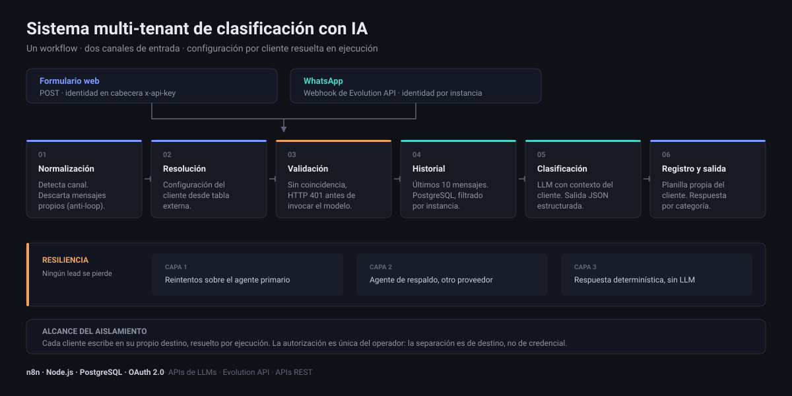

# Sistema multi-tenant de clasificación y respuesta automática con IA



Arquitectura de automatización sobre n8n que recibe solicitudes por dos canales distintos, resuelve la configuración del cliente en tiempo de ejecución, clasifica el mensaje con un LLM y responde por el canal de origen, con tres capas de resiliencia ante fallas del modelo.

Un único workflow atiende a todos los clientes. Incorporar uno nuevo es agregar una fila a una tabla de configuración externa: el flujo no se edita nunca.

---

## Problema

Un clasificador de leads con IA es simple de construir para un cliente. Deja de serlo cuando aparecen cuatro requisitos a la vez:

1. **Multi-tenancy sin duplicar workflows.** Cada cliente tiene su rubro, su oferta, su tono y su destino de datos. Mantener un workflow por cliente vuelve el mantenimiento inviable.
2. **Dos canales de entrada con identidad distinta.** Un formulario web se autentica con una clave; un mensaje de WhatsApp llega sin credencial alguna, identificado solo por la instancia que lo recibió.
3. **Continuidad ante fallas del proveedor de LLM.** Un 429, un timeout o un JSON malformado no pueden hacer que se pierda un lead.
4. **Coherencia conversacional.** La respuesta tiene que considerar lo que la persona ya dijo antes, sin construir un almacén de conversaciones paralelo.

Este repositorio documenta cómo se resolvió cada uno.

---

## Arquitectura

```
Formulario web (POST + header x-api-key)          WhatsApp (webhook de Evolution API)
             │                                                    │
             └──────────────────────┬─────────────────────────────┘
                                    ▼
                        ┌───────────────────────┐
                        │ Normalización         │  Detecta el canal
                        │ y filtrado anti-loop  │  Descarta los mensajes propios
                        └───────────┬───────────┘
                                    ▼
                        ┌───────────────────────┐
                        │ Resolución del tenant │  Formulario → por API key
                        │ (tabla externa)       │  WhatsApp   → por instancia
                        └───────────┬───────────┘
                                    ▼
                        ┌───────────────────────┐
                        │ Validación            │  Sin coincidencia → HTTP 401
                        │                       │  Corta antes de invocar el modelo
                        └───────────┬───────────┘
                                    ▼
                        ┌───────────────────────┐
                        │ Recuperación de       │  Últimos 10 mensajes del contacto
                        │ historial             │  PostgreSQL de Evolution API
                        └───────────┬───────────┘
                                    ▼
                        ┌───────────────────────┐
                        │ Clasificación con LLM │  Contexto de negocio del tenant
                        │ (3 capas de fallback) │  Salida JSON estructurada
                        └───────────┬───────────┘
                                    ▼
                        ┌───────────────────────┐
                        │ Persistencia          │  Planilla propia de cada cliente
                        │                       │  Destino resuelto en ejecución
                        └───────────┬───────────┘
                                    ▼
                        ┌───────────────────────┐
                        │ Respuesta por         │  Ruteo por categoría asignada
                        │ categoría y canal     │  WhatsApp o respuesta HTTP
                        └───────────────────────┘
```

Descripción detallada de cada capa en [`arquitectura.md`](arquitectura.md).

---

## Decisiones de diseño

### 1. Configuración por tenant en tabla externa, no en el workflow

Los datos de cada cliente —nombre del negocio, rubro, oferta, tono de respuesta, planilla de destino, instancia de mensajería y clave de API— se resuelven en tiempo de ejecución desde una tabla de configuración externa.

**Consecuencia:** incorporar un cliente es agregar una fila. El workflow permanece constante. El costo es una lectura adicional por ejecución y un punto de falla más.

### 2. Clave de resolución distinta por canal

El mismo webhook atiende formulario web y WhatsApp, pero la identidad del tenant no llega de la misma forma en los dos casos.

| Canal | Clave de resolución | Origen |
|---|---|---|
| Formulario web | API key | Cabecera `x-api-key` |
| WhatsApp | Nombre de instancia | Cuerpo del webhook de Evolution API |

**Consecuencia:** un solo flujo cubre ambos canales sin ramificar la lógica de negocio. La normalización ocurre en el primer nodo y todo lo que sigue trabaja sobre una estructura única.

**Costo aceptado:** las dos claves no ofrecen la misma garantía. La API key es un secreto; el nombre de instancia, no. Ver [Alcance del aislamiento](#alcance-del-aislamiento).

### 3. Validación antes de invocar el modelo

Si la clave entrante no resuelve contra ninguna fila de configuración, la ejecución responde `401` y termina.

**Motivo:** los tokens de LLM son el costo variable dominante. Validar primero acota la superficie de abuso a una lectura de la tabla de configuración por solicitud.

### 4. Reutilizar el almacén de mensajes existente como capa de memoria

El historial conversacional no se guarda en una tabla propia. Se consulta directamente contra la base PostgreSQL de Evolution API, que ya persiste todos los mensajes de WhatsApp.

La consulta recupera los últimos 10 mensajes del contacto, filtrando por identificador de conversación **y** por instancia, de modo que la ventana nunca cruza entre clientes. Está en [`consulta-memoria.sql`](consulta-memoria.sql).

**Motivo:** una tabla propia de conversaciones sería una segunda copia de datos que ya existen, con su propia lógica de escritura, su propio crecimiento y su propia posibilidad de desincronizarse.

**Costo aceptado:** el sistema queda acoplado al esquema interno de Evolution API. Si una actualización renombra las tablas `Message` o `Instance`, la consulta se rompe. Es una dependencia de la que hay que estar al tanto al actualizar.

**Alcance real:** la memoria funciona solo en el canal de WhatsApp. Los envíos por formulario no tienen historial previo que recuperar, y el sistema los trata como primer contacto.

### 5. Tres capas de resiliencia ante fallas del modelo

| Capa | Mecanismo | Cubre |
|---|---|---|
| 1 | Reintentos automáticos sobre el agente primario | Errores transitorios, rate limiting |
| 2 | Segundo agente con un proveedor de LLM distinto | Indisponibilidad del proveedor primario |
| 3 | Respuesta determinística construida en código | Salida vacía o JSON no parseable |

El agente primario está configurado para continuar la ejecución en caso de error en lugar de abortarla. Un nodo condicional detecta el error y desvía al agente de respaldo, que corre sobre otro proveedor.

La capa 3 no invoca ningún modelo: si después de todo eso no hay una salida parseable, el nodo de parseo devuelve una clasificación neutra con una respuesta genérica y marca el registro con `FALLO IA - revisión manual urgente`.

**Criterio:** el sistema puede degradar la calidad de la respuesta, pero no puede perder un lead. Una respuesta genérica es un resultado aceptable; un mensaje sin registrar, no.

### 6. Ruteo por categoría con salida explícita para lo no clasificado

El clasificador asigna una de tres categorías —`CALIENTE`, `TIBIO`, `FRÍO`— y cada una tiene su propia rama de respuesta. El nodo de ruteo declara además una **salida de descarte** para cualquier valor fuera de ese conjunto, con su propia respuesta.

**Motivo:** sin salida de descarte, una categoría inesperada del modelo haría que la ejecución termine sin responder nada. El lead quedaría registrado pero sin contestar, que es la falla más silenciosa y más cara del sistema.

---

## Alcance del aislamiento

Esta sección existe porque es donde más fácil sería sobrevender el diseño.

**Lo que el sistema sí garantiza:**

- Cada cliente escribe en **su propia planilla**. El destino no está fijo en el flujo: se resuelve por ejecución desde la configuración del tenant.
- La ventana de historial filtra siempre por instancia, de modo que **la memoria no cruza entre clientes**.
- Un formulario sin API key válida no llega a ejecutar nada.

**Lo que el sistema no garantiza:**

- **El operador de la plataforma tiene acceso a los datos de todos los clientes.** Las escrituras se hacen con una única credencial OAuth, la de la cuenta que opera el sistema. La separación es de destino, no de autorización.
- **El canal de WhatsApp no está autenticado por secreto.** El tenant se resuelve por nombre de instancia, que no es una credencial. La protección efectiva es que el webhook solo recibe tráfico de la instancia de Evolution API configurada.
- **El aislamiento depende de que la lógica resuelva bien el destino.** Es una garantía de código, no de infraestructura: un error en la resolución del tenant escribiría en la planilla equivocada.

Llevar esto a un aislamiento real por infraestructura requiere una credencial OAuth por cliente, autorizada por el propio cliente sobre su almacenamiento. Está descrito como evolución pendiente en [`decisiones-tecnicas.md`](decisiones-tecnicas.md#d6--evolución-pendiente-autorización-por-cliente).

---

## Stack

| Componente | Tecnología |
|---|---|
| Orquestación de flujos | n8n (self-hosted, Docker) |
| Clasificación primaria | LLM de proveedor A |
| Clasificación de respaldo | LLM de proveedor B |
| Memoria conversacional | PostgreSQL (base de Evolution API) |
| Configuración de tenants | Hoja de cálculo externa |
| Persistencia por cliente | Hoja de cálculo del cliente, vía OAuth 2.0 |
| Canal de mensajería | Evolution API |
| Lógica auxiliar | JavaScript / Node.js |

---

## Contenido del repositorio

| Archivo | Contenido |
|---|---|
| [`arquitectura.md`](arquitectura.md) | Descripción detallada de cada capa |
| [`decisiones-tecnicas.md`](decisiones-tecnicas.md) | Decisiones, alternativas descartadas y evolución pendiente |
| [`consulta-memoria.sql`](consulta-memoria.sql) | Consulta real de recuperación del historial |
| [`configuracion-tenants.md`](configuracion-tenants.md) | Estructura de la tabla de configuración |
| [`sanitizar-workflow.js`](sanitizar-workflow.js) | Limpieza de identificadores antes de publicar una exportación |
| [`payload-formulario.json`](payload-formulario.json) | Ejemplo de solicitud entrante por formulario |
| `arquitectura.svg` | Diagrama del flujo completo |

Este repositorio publica la documentación de arquitectura y las decisiones de diseño. **La exportación del workflow no se incluye**, por lo que se explica en la sección siguiente.

---

## Por qué no se publica la exportación

Una exportación de n8n incluye, en texto plano, todo lo que esté escrito dentro de los nodos: identificadores de planillas y documentos, rutas de webhook, nombres de instancias de mensajería y cualquier valor cargado directamente en un campo. Las credenciales guardadas en el gestor de n8n no se exportan, pero sí los identificadores que las referencian.

En un sistema multi-tenant eso es especialmente delicado: la tabla de configuración es la puerta de entrada a los datos de todos los clientes, y su identificador aparece en el flujo.

`sanitizar-workflow.js` es la herramienta que se usa sobre una exportación antes de compartirla en cualquier contexto:

```bash
node sanitizar-workflow.js workflow.raw.json workflow.json
```

Reemplaza los patrones sensibles conocidos y verifica que el resultado siga siendo JSON válido. No sustituye la revisión manual del archivo resultante.

**Lista de verificación antes de compartir cualquier exportación:**

- [ ] Sin claves de API en cabeceras ni en nodos de validación
- [ ] Sin identificadores de hojas de cálculo, bases o documentos reales
- [ ] Sin identificadores de credenciales del gestor de n8n
- [ ] Sin rutas de webhook propias ni URLs de instancia
- [ ] Sin nombres de instancias de mensajería
- [ ] Sin números de teléfono, correos ni nombres de clientes
- [ ] Nombres de nodos genéricos, sin referencias a clientes

---

## Reproducción

1. Levantar una instancia de n8n con acceso a la base PostgreSQL de Evolution API.
2. Crear la tabla de configuración de tenants con la estructura descrita en [`configuracion-tenants.md`](configuracion-tenants.md).
3. Reproducir el flujo en n8n siguiendo la descripción de capas de [`arquitectura.md`](arquitectura.md).
4. Configurar las credenciales desde el gestor de n8n. **Ningún valor sensible debe escribirse dentro de un nodo, y ninguna credencial se versiona en este repositorio.**
5. Registrar la URL del webhook en Evolution API y en el formulario de origen.

---

## Estado

Sistema en producción. El flujo está activo y atiende ambos canales.

---

## Licencia

MIT — ver [`LICENSE`](LICENSE).
